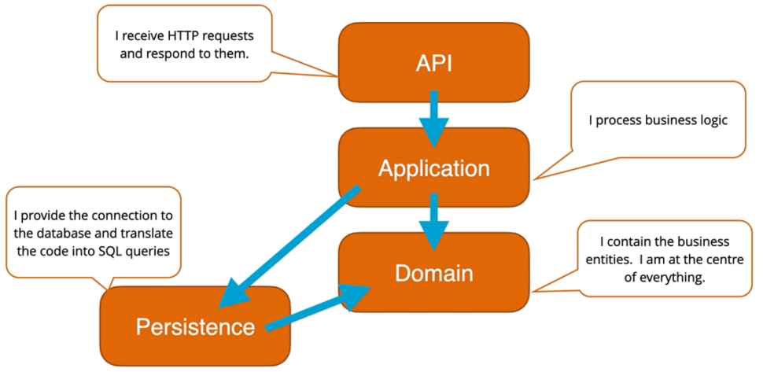

# Reactivities

CRUD application using the CQRS + Mediator pattern

***

## Persistance

Provides the connection to the database and translate the code into SQL queries.

Dependencies:

- Domain

Packages:

***

## API

Recieves HTTP Requests and responds to them.

Dependencies:

- Application

Packages:

***

## Application

Processes the business logic

Dependencies:

- Domain
- Persistance

Packages:

***

## Domain

Contains the business entities. At the center of the project, has no dependencies.

Packages:

***

## UI Project (React)
